# 🪵 Urban Furniture Accounting System

[](https://github.com/Raj-Surase/Urban-Furniture-Accounting-System)
[](https://laravel.com)
[](https://react.dev)
[](https://www.typescriptlang.org)
[](https://tailwindcss.com)
[](https://socket.io)
[](https://razorpay.com)
[](LICENSE)

> **A production-grade, double-entry manufacturing & civic furniture accounting ERP engineered for the Odoo Hackathon 2026.**  
> Features real-time general ledger reconciliation, parametric 3D Joinery Studio, statutory Indian GST compliance (CGST/SGST/IGST), analytical multi-period budgeting, client self-service portal with contact-scoped RBAC, and instant Razorpay settlement.

---

## 📑 Table of Contents

- [Executive Summary](#-executive-summary)
- [Development Thought Process & Architectural Journey](#-development-thought-process--architectural-journey)
  - [1. Problem Decomposition: Why Off-the-Shelf Accounting Fails for Manufacturing](#1-problem-decomposition-why-off-the-shelf-accounting-fails-for-manufacturing)
  - [2. Enforcing Strict Double-Entry Parity Down to the Paisa](#2-enforcing-strict-double-entry-parity-down-to-the-paisa)
  - [3. Bridging Shop-Floor Fabrication to ERP: The 3D Joinery Studio](#3-bridging-shop-floor-fabrication-to-erp-the-3d-joinery-studio)
  - [4. Event-Driven Real-Time Synchronization (Zero Polling)](#4-event-driven-real-time-synchronization-zero-polling)
  - [5. Automated Digital Treasury & Reconciliation (Razorpay)](#5-automated-digital-treasury--reconciliation-razorpay)
  - [6. Contact-Scoped RBAC & Self-Service Experience](#6-contact-scoped-rbac--self-service-experience)
- [System Architecture & Data Flow Diagrams](#-system-architecture--data-flow-diagrams)
  - [Full-Stack System Topology](#full-stack-system-topology)
  - [Quote-to-Cash & Procure-to-Pay Transaction Lifecycles](#quote-to-cash--procure-to-pay-transaction-lifecycles)
  - [Automated Double-Entry General Ledger Mechanics](#automated-double-entry-general-ledger-mechanics)
  - [Parametric 3D CAD to Procurement Pipeline](#parametric-3d-cad-to-procurement-pipeline)
  - [Role-Based Access Control (RBAC) Security Matrix](#role-based-access-control-rbac-security-matrix)
  - [Analytic Accounting & Budget Variance Engine](#analytic-accounting--budget-variance-engine)
- [Visual Product Tour & Operational Walkthrough](#-visual-product-tour--operational-walkthrough)
- [Core Functional Modules](#-core-functional-modules)
- [Repository Structure](#-repository-structure)
- [Quick Start Guide](#-quick-start-guide)
  - [Prerequisites](#prerequisites)
  - [One-Command Installation](#one-command-installation)
  - [Booting All Services Concurrently](#booting-all-services-concurrently)
  - [Pre-Seeded Demo Evaluation Personas](#pre-seeded-demo-evaluation-personas)
- [Docker Deployment](#-docker-deployment)
- [Verification & Testing](#-verification--testing)
- [Hackathon Compliance Checklist](#-hackathon-compliance-checklist)

---

## 🎯 Executive Summary

Urban Furniture is a high-volume manufacturing and municipal civic contracting enterprise specializing in bespoke timber street furniture, public park installations, and architectural woodwork.

In high-mix furniture production, business operations face a severe disconnect:
1. **Designers and sales engineers** customize dimensions, wood species, and upholstery in 3D CAD or spreadsheets.
2. **Purchasing teams** re-estimate timber board-feet and hardware manually, causing inaccurate purchase orders.
3. **Accounting departments** struggle with unlinked invoices, mismatched cost centers, unbalanced ledgers, and delayed payment reconciliation.

The **Urban Furniture Accounting System** bridges this operational-financial chasm. It combines:
- **Strict Double-Entry Ledger Mechanics**: Automatically posts balanced debits and credits on invoice approvals and settlements. Unbalanced journal entries are blocked by database constraints.
- **Parametric 3D Workshop Studio**: A real-time procedural 3D visualizer that calculates volumetric material costs, labor overhead, GST, and profit margins, dispatching custom specifications straight into backend Purchase Orders with one click.
- **Statutory GST Accounting**: Native support for intra-state (CGST 9% + SGST 9%) and inter-state (IGST 18%) tax compliance with HSN codes and vector PDF invoice generation.
- **Client Self-Service Portal**: Contact-scoped RBAC allowing customers to review their ledger statements and pay outstanding dues via integrated Razorpay gateway.
- **Bi-Directional Live Synchronization**: Node.js + Socket.io microservice broadcasting real-time ledger events to all active connected clients without page reloads or polling.

---

## 🧠 Development Thought Process & Architectural Journey

### 1. Problem Decomposition: Why Off-the-Shelf Accounting Fails for Manufacturing
When we analyzed standard open-source accounting templates, we noticed a critical flaw: they treat products as static inventory records with fixed prices. In bespoke urban furniture manufacturing, **no two municipal projects are identical**. A park bench commissioned in Burmese Teak with stainless steel brackets has completely different timber yield requirements, scrap factors, and tax treatments than an interior oak bench.

We framed our development around three core requirements:
1. **Financial Integrity First**: Every operational event (sales confirmation, raw timber receipt, vendor bill approval, customer payment) must immediately update the general ledger without manual bookkeeping.
2. **Zero-Disconnect Shop Floor**: The CAD/3D configuration stage must feed directly into procurement and costing.
3. **Enterprise Scalability & Speed**: The interface must handle hundreds of ledger rows with multi-field filtering, infinite scroll, instant feedback, and zero-latency WebSocket broadcasts.

---

### 2. Enforcing Strict Double-Entry Parity Down to the Paisa
In double-entry bookkeeping, **$\sum \text{Debits} = \sum \text{Credits}$** is an inviolable law. Rather than relying on frontend accuracy, we built a layered validation mechanism:
- **Eloquent Model Event Listeners**: When a Sales Invoice is approved (`POST /api/invoices/{id}/approve`), the backend triggers an automated transaction posting:
  - **Debit**: Accounts Receivable (Debtors A/c `1121`) for the total invoiced amount.
  - **Credit**: Sales Income A/c (`4111`) for the net untaxed product revenue.
  - **Credit**: Statutory GST Output Liability A/c (`2131`) for the tax collected.
- **Hard Parity Constraint**: The `JournalEntryController` computes `abs(sum(debit) - sum(credit))`. If the delta exceeds `0.001`, the entire database transaction is rolled back with an explicit `422 Unprocessable Entity` validation exception.
- **Automatic Offset on Settlement**: When an invoice is paid via Bank or Cash, the system automatically posts:
  - **Debit**: Bank / Cash A/c (`1111` or `1112`).
  - **Credit**: Accounts Receivable A/c (`1121`), zeroing out customer debt.

---

### 3. Bridging Shop-Floor Fabrication to ERP: The 3D Joinery Studio
A key innovation developed during this hackathon is the **3D Workshop Studio** (`/workshop`). We asked ourselves: *Why should custom product configuration happen outside the ERP?*

```text
[ Parametric Dimensions: W × D × H ]
             │
             ▼
[ Volumetric Timber Calculation: (W × D × H × Density Factor) ]
             │
             ▼
[ Real-Time Pricing Engine: Material Cost + Labor + Margin + GST ]
             │
             ▼
[ "Procure Custom Timber & Specs" (1-Click Action) ]
             │
             ▼
[ Backend Purchase Order Created with Exact Specifications & HSN ]
```

- **Procedural 3D Visualizer**: Rendered with CSS 3D transforms, dynamic lighting, and texture shading with Isometric, Front, Top, and AR Room viewpoints.
- **Dynamic Physics & Costing Formula**:
  $$\text{Volume} = \frac{W \times D \times H}{1,000,000} \text{ m}^3$$
  $$\text{Raw Timber Cost} = \text{Volume} \times \text{Species Density Rate}$$
  $$\text{Base Selling Price} = (\text{Timber Cost} + \text{Hardware} + \text{Labor}) \times (1 + \text{Target Margin})$$
- **1-Click Procurement Generation**: Pressing **"Procure Custom Timber & Specs"** sends payload specs (species, millimeter dimensions, finishing type) directly to `POST /api/purchase-orders`, pre-populating line items and vendor specifications.

---

### 4. Event-Driven Real-Time Synchronization (Zero Polling)
In a multi-user accounting environment, when an accountant posts an invoice or registers a payment, other departments (sales, warehouse, executive dashboard) must see the updated numbers immediately without refreshing the page.

Rather than overloading Laravel with polling requests every few seconds, we decoupled the real-time layer:
- **Node.js Socket.io Broadcast Service**: Runs on port `3001` as a lightweight event router.
- **Internal Webhook Dispatcher**: Whenever Laravel persists an accounting action, `RealtimeService` sends an internal HTTP POST to `http://localhost:3001/api/broadcast`.
- **Targeted Topic Channels**: Frontend React hooks listen to channels like `invoice:posted`, `payment:reconciled`, and `item:updated`. UI widgets update their state reactively and show toast notifications in real time.

---

### 5. Automated Digital Treasury & Reconciliation (Razorpay)
Standard hackathon projects stop at recording manual cash entries. We integrated a full **Razorpay Payment Gateway workflow**:
1. **Server-Side Order Generation**: Laravel creates a verified Razorpay order with cryptographically signed order IDs and amount bounds.
2. **Embedded Branded Checkout Modal**: Built with a **Mock Sandbox Mode** toggle so evaluators can test instant end-to-end payment flows without needing external payment credentials.
3. **Webhook Callback Verification**: Upon payment authorization, the signature is cryptographically verified using SHA256 HMAC.
4. **Instant GL Reconciliation**: The callback doesn't just change an invoice flag—it generates a balanced `JournalEntry` booking cash to the Bank Ledger and reconciling Accounts Receivable.
5. **Treasury Management**: A dedicated Transaction Ledger tracks platform gateway fees, order references, and supports one-click automated refunds.

---

### 6. Contact-Scoped RBAC & Self-Service Experience
Enterprise accounting requires strict access segmentation:
- **Admin**: Complete system sovereignty—master data, chart of accounts, budget revisions, user role management, system metrics.
- **Invoicing User (Accountant)**: Operates transactional workflows—creates sales/purchase orders, approves invoices, posts journal entries, and views financial reports (Balance Sheet, P&L, Budgets).
- **Contact (Customer / Vendor)**: Customers logging into the system access the **Client Self-Service Portal** (`/portal`). Contact-scoped RBAC ensures they only see their own invoices, total outstanding balances, and an instant **"Pay Now"** button powered by Razorpay. Internal general ledgers, journals, and administrative settings are completely hidden.

---

## 🏛️ System Architecture & Data Flow Diagrams

### Full-Stack System Topology

```text
┌─────────────────────────────────────────────────────────────────────────────────┐
│                           Client Tier (React 18 SPA)                            │
│                  TypeScript • Tailwind CSS v4 • HeroUI • Framer Motion          │
│                                                                                 │
│   ┌───────────────────┐  ┌───────────────────┐  ┌───────────────────────────┐  │
│   │ Executive Board   │  │ 3D Joinery Studio │  │ Customer Portal (/portal) │  │
│   │ - Live KPI Cards  │  │ - Procedural 3D   │  │ - Contact-Scoped Invoices │  │
│   │ - Dual Wave Curve │  │ - Parametric Spec │  │ - Instant Razorpay Modal  │  │
│   │ - Ledger Streams  │  │ - 1-Click PO      │  │ - Receipt Vector PDF      │  │
│   └─────────┬─────────┘  └─────────┬─────────┘  └─────────────┬─────────────┘  │
│             │ HTTP Requests (Bearer)│                          │                │
│             ▼                       ▼                          ▼                │
│       [Axios Interceptor] ───▶ Automatic 401 Re-route ───▶ Auth State           │
└─────────────┬──────────────────────────────────────────────────▲────────────────┘
              │ REST JSON API Requests                           │ WebSocket Events
              ▼                                                  │
┌────────────────────────────────────────────────────────┐       │
│                  Application Tier                      │       │
│              Laravel 13 REST API Framework             │       │
│                                                        │       │
│  ┌────────────────────┐      ┌──────────────────────┐  │       │
│  │ Sanctum Auth &     │      │ GST Tax Engine       │  │       │
│  │ Role Middleware    │      │ - CGST (9%) SGST(9%) │  │       │
│  │ - Admin / Acc / Con│      │ - IGST (18%)         │  │       │
│  └─────────┬──────────┘      └──────────┬───────────┘  │       │
│            ▼                            ▼              │       │
│  ┌────────────────────┐      ┌──────────────────────┐  │       │
│  │ Commercial Engines │      │ Double-Entry Core    │  │       │
│  │ - Sales / Purchases│      │ - Automated GL Post  │  │       │
│  │ - Invoices / Bills │      │ - Parity Check (D=C) │  │       │
│  │ - Analytic Budgets │      │ - Balance Sheet/P&L  │  │       │
│  └─────────┬──────────┘      └──────────┬───────────┘  │       │
│            │                            │              │       │
│            ▼                            ▼              │       │
│  ┌──────────────────────────────────────────────────┐  │       │
│  │ RealtimeService (HTTP Webhook Dispatcher)        │──┼───────┼────────┐
│  └──────────────────────────────────────────────────┘  │       │        │
└─────────────┬──────────────────────────────────────────┘       │        │
              │ Eloquent ORM                                     │        │
              ▼                                                  │        ▼
┌───────────────────────────────────────┐            ┌───────────┴──────────────┐
│            Persistence Tier           │            │ Realtime Broadcast Tier  │
│           SQLite / MySQL RDBMS        │            │  Node.js + Socket.io     │
│ - Normalized schema (19 migrations)   │            │  Port 3001               │
│ - Strict foreign keys & cascades      │            │ - Channel room dispatch  │
│ - Transactional ACID boundary         │            │ - HTTP /broadcast ingress│
└───────────────────────────────────────┘            └──────────────────────────┘
```

---

### Quote-to-Cash & Procure-to-Pay Transaction Lifecycles

```mermaid
flowchart TD
    subgraph SALES["Commercial Sales Flow (Quote-to-Cash)"]
        SO["Sales Order (SO-2026-XXXX)<br/>Customer, Items, Taxes, Analytic A/c"] -->|1-Click 'Create Invoice'| INV["Customer Invoice (INV-2026-XXXX)<br/>Draft State, Auto-Sequenced"]
        INV -->|Action: 'Approve & Post'| POSTED_INV["Posted Invoice<br/>Status: Approved"]
        POSTED_INV -->|Automated Trigger| GL_SALE["Auto GL Journal Entry<br/>Debit: Debtors A/c (1121)<br/>Credit: Sales Income (4111)<br/>Credit: GST Output (2131)"]
        POSTED_INV -->|Client Action: 'Pay Now' / Razorpay| PAY["Payment Settlement<br/>Mode: Bank Checking / Razorpay"]
        PAY -->|Automated Trigger| GL_SETTLE["Reconciliation Journal Entry<br/>Debit: Bank Checking (1111)<br/>Credit: Debtors A/c (1121)"]
        GL_SETTLE --> PAID_INV["Invoice Marked PAID<br/>Balance Due: Rs 0.00"]
    end

    subgraph PROCURE["Procurement Flow (Procure-to-Pay)"]
        PO["Purchase Order (PO-2026-XXXX)<br/>Timber Vendor, Board Feet, Raw Cost"] -->|1-Click 'Create Bill'| BILL["Vendor Bill (BILL-2026-XXXX)<br/>Draft State, Links to PO Badge"]
        BILL -->|Action: 'Approve & Post'| POSTED_BILL["Posted Bill<br/>Default Purchase Expense A/c"]
        POSTED_BILL -->|Automated Trigger| GL_BILL["Auto GL Journal Entry<br/>Debit: Purchase Expense (5111)<br/>Credit: Creditors Liability (2111)"]
        POSTED_BILL -->|Accountant Action: 'Record Payment'| VENDOR_PAY["Payment Disbursement<br/>Mode: Bank Wire / Cash"]
        VENDOR_PAY -->|Automated Trigger| GL_VPAY["Reconciliation Journal Entry<br/>Debit: Creditors Liability (2111)<br/>Credit: Bank Checking (1111)"]
        GL_VPAY --> PAID_BILL["Bill Marked PAID<br/>Balance Due: Rs 0.00"]
    end
```

---

### Automated Double-Entry General Ledger Mechanics

```text
┌─────────────────────────────────────────────────────────────────────────────────┐
│                    Strict Double-Entry Parity Principle                         │
│                    Total Debits  ===  Total Credits (0.00)                      │
└─────────────────────────────────────────────────────────────────────────────────┘

1. CUSTOMER INVOICE APPROVAL (INV/2026/0001) - ₹11,800
   ┌───────────────────────────────┬──────────────┬──────────────┐
   │ Account Name & Code           │ Debit (₹)    │ Credit (₹)   │
   ├───────────────────────────────┼──────────────┼──────────────┤
   │ 1121 - Accounts Receivable    │ 11,800.00    │         0.00 │
   │ 4111 - Sales Income           │         0.00 │    10,000.00 │
   │ 2131 - GST Output Tax (18%)   │         0.00 │     1,800.00 │
   ├───────────────────────────────┼──────────────┼──────────────┤
   │ TOTALS (Balanced: ₹0.00 delta)│ 11,800.00    │    11,800.00 │
   └───────────────────────────────┴──────────────┴──────────────┘

2. CUSTOMER PAYMENT SETTLEMENT (PAY/2026/0001) - ₹11,800
   ┌───────────────────────────────┬──────────────┬──────────────┐
   │ Account Name & Code           │ Debit (₹)    │ Credit (₹)   │
   ├───────────────────────────────┼──────────────┼──────────────┤
   │ 1111 - Bank Checking Account  │ 11,800.00    │         0.00 │
   │ 1121 - Accounts Receivable    │         0.00 │    11,800.00 │
   ├───────────────────────────────┼──────────────┼──────────────┤
   │ TOTALS (Balanced: ₹0.00 delta)│ 11,800.00    │    11,800.00 │
   └───────────────────────────────┴──────────────┴──────────────┘

3. VENDOR BILL APPROVAL (BILL/2026/0001) - ₹8,260
   ┌───────────────────────────────┬──────────────┬──────────────┐
   │ Account Name & Code           │ Debit (₹)    │ Credit (₹)   │
   ├───────────────────────────────┼──────────────┼──────────────┤
   │ 5111 - Purchase Expense A/c   │  7,000.00    │         0.00 │
   │ 1131 - GST Input Tax (18%)    │  1,260.00    │         0.00 │
   │ 2111 - Accounts Payable       │         0.00 │     8,260.00 │
   ├───────────────────────────────┼──────────────┼──────────────┤
   │ TOTALS (Balanced: ₹0.00 delta)│  8,260.00    │     8,260.00 │
   └───────────────────────────────┴──────────────┴──────────────┘
```

---

### Parametric 3D CAD to Procurement Pipeline

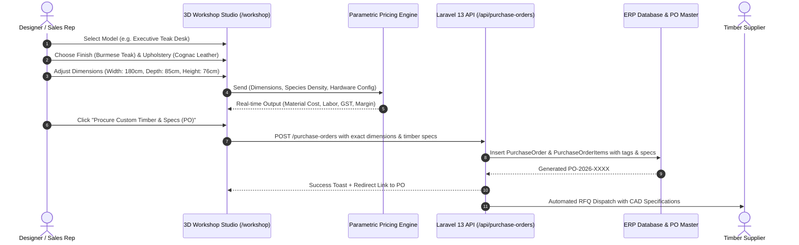

---

### Role-Based Access Control (RBAC) Security Matrix

| Feature / Action | 👑 Admin | 💼 Invoicing User (Accountant) | 👤 Contact (Customer) |
| :--- | :---: | :---: | :---: |
| **Executive Dashboard & KPIs** | ✅ Full Access | ✅ Full Access | ❌ Restricted |
| **Contact Master (Kanban & List)** | ✅ Create / Edit / Archive | ✅ View / Edit | ❌ Restricted |
| **Product Master & Stock Adjustments** | ✅ Full Control | ✅ View / Use | ❌ Restricted |
| **Chart of Accounts (CoA) & Journals** | ✅ Full Control | ✅ View / Post | ❌ Restricted |
| **Sales & Purchase Orders** | ✅ Full Control | ✅ Full Control | ❌ Restricted |
| **Invoices & Vendor Bills** | ✅ Full Control | ✅ Full Control | 👁️ Own Invoices Only |
| **Double-Entry General Ledger** | ✅ Full Audit & Reversals | ✅ View / Post Entries | ❌ Restricted |
| **Financial Reports (Balance Sheet, P&L)** | ✅ Full Access | ✅ Full Access | ❌ Restricted |
| **Analytic Accounts & Budgets** | ✅ Full Control / Revisions | ✅ Operational Tracking | ❌ Restricted |
| **3D Workshop Studio** | ✅ Full Access | ✅ Full Access | ❌ Restricted |
| **Client Portal (`/portal`)** | 👁️ Preview Mode | 👁️ Preview Mode | ✅ Primary Dedicated View |
| **Razorpay Payment Settlement** | ✅ Admin & Gateway Audit | ✅ Verify Reconciliations | ✅ Instant 1-Click Settlement |
| **User Governance & RBAC Matrix** | ✅ Full Management | ❌ Restricted | ❌ Restricted |

---

### Analytic Accounting & Budget Variance Engine

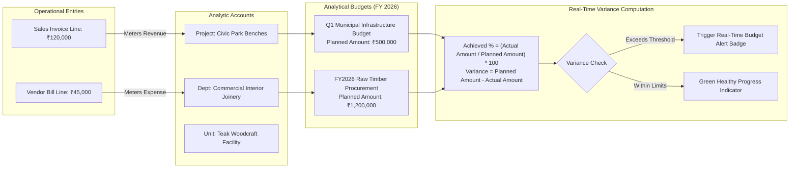

---

## 📸 Visual Product Tour & Operational Walkthrough

Every visual asset in `assets/` corresponds directly to an operational capability in the system:

---

### 1. Executive Financial & Operations Dashboard
> **Route:** `/` | **Persona:** Admin & Accountant  
> Real-time command center featuring primary KPI cards (Total Receivables, Payables, Net Income, Liquid Cash), dual-wave analytics curves, live activity heatmaps, and a WebSocket status badge confirming bidirectional connection.

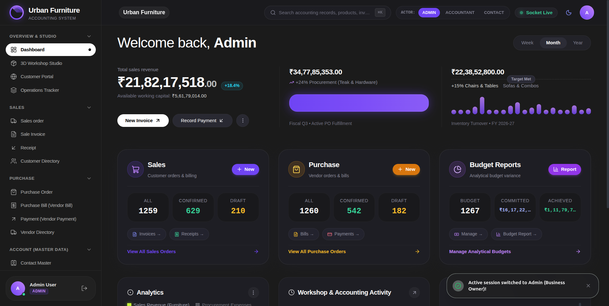

*Key Highlights:*
- **Real-Time WebSocket Indicator**: Confirms live event streaming with the Node.js broadcast microservice.
- **Operational Summary Cards**: Direct drill-downs into Sales, Procurement, and Analytical Budgets.
- **Quick Action Bar**: Fast triggers for "New Invoice" and "Record Payment".

---

### 2. Commercial Sales Order Management
> **Route:** `/sales-orders` | **Persona:** Admin & Accountant  
> Full lifecycle sales order tracking with customer selection, item lines, tax calculations, and status progression (Quotation $\rightarrow$ Confirmed $\rightarrow$ Invoiced).

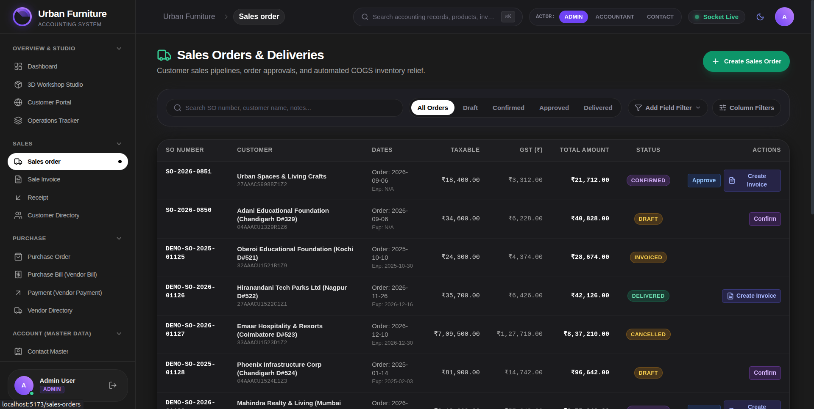

*Key Highlights:*
- **1-Click Invoice Generation**: Clicking "Create Invoice" transfers customer details, line items, and taxes with zero re-entry.
- **Analytic Account Mapping**: Every sales item is mapped to its analytical cost center for real-time profitability tracking.

---

### 3. Customer Sales Invoice & Vector Tax PDF
> **Route:** `/invoices` | **Persona:** Admin, Accountant & Contact (View)  
> Automated invoicing with GST tax breakdowns, HSN codes, source document badges, and instant vector PDF preview.

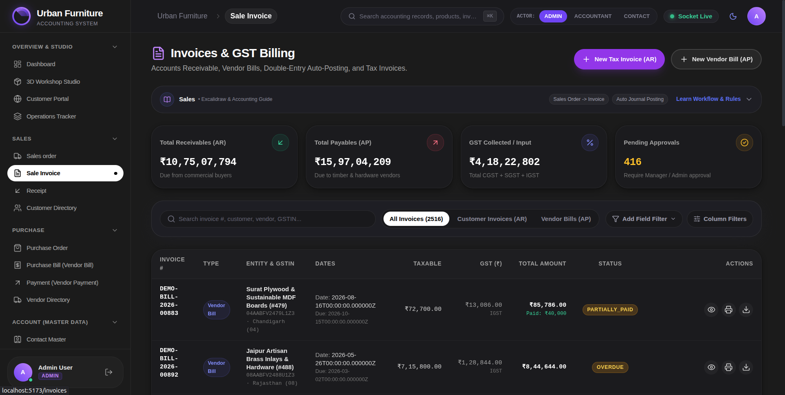

*Key Highlights:*
- **Traceable Source SO Badge**: Clickable button linking back directly to the originating Sales Order.
- **Vector PDF Invoice**: High-fidelity, printable tax invoice with company letterhead, GST computations, and payment instructions.
- **Automated GL Posting**: Triggered instantaneously upon invoice approval.

---

### 4. Raw Material Procurement & Purchase Orders
> **Route:** `/purchase-orders` | **Persona:** Admin & Accountant  
> Procurement system for sourcing raw timber, architectural joinery hardware, and shop supplies.

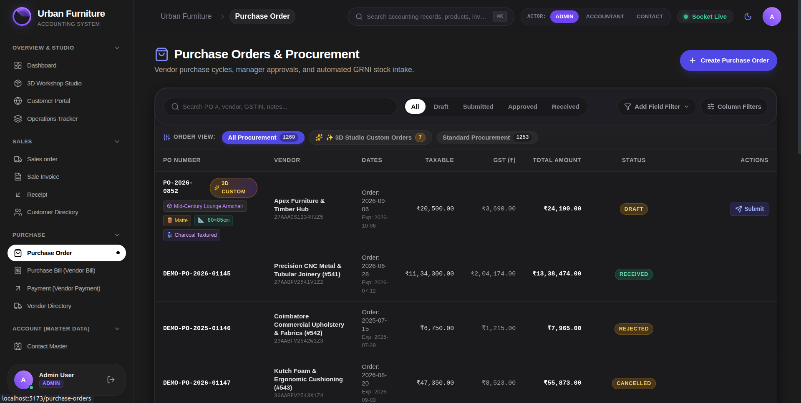

*Key Highlights:*
- **Direct 3D Studio Ingress**: Receives parametric custom dimensions and timber specifications directly from the 3D visualizer.
- **Vendor Workflow**: Draft $\rightarrow$ Submitted $\rightarrow$ Approved $\rightarrow$ Received $\rightarrow$ Billed.

---

### 5. Vendor Bills & Purchase Expense Management
> **Route:** `/bills` | **Persona:** Admin & Accountant  
> Accounts Payable invoice management with default Purchase Expense account mapping and linked PO references.

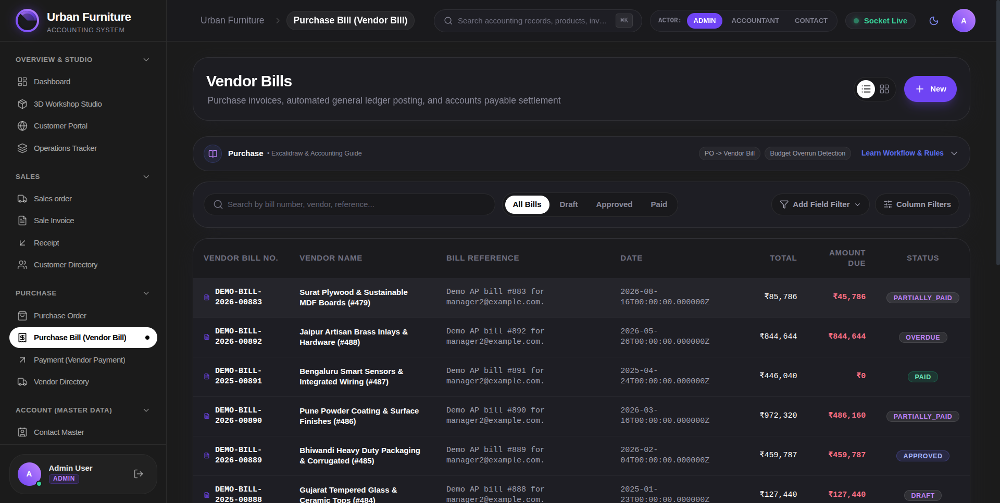

*Key Highlights:*
- **Auto Chart of Accounts Assignment**: Defaults automatically to "Purchase Expense A/c (5111)".
- **Automated AP Ledger**: Credits Accounts Payable Liability (`2111`) and debits Purchase Expense (`5111`).

---

### 6. Payment Receipt & Settlement Modal
> **Route:** `/payments` | **Persona:** Admin & Accountant  
> Treasury settlement modal supporting Bank, Cash, and digital methods with instant balance recalculation.

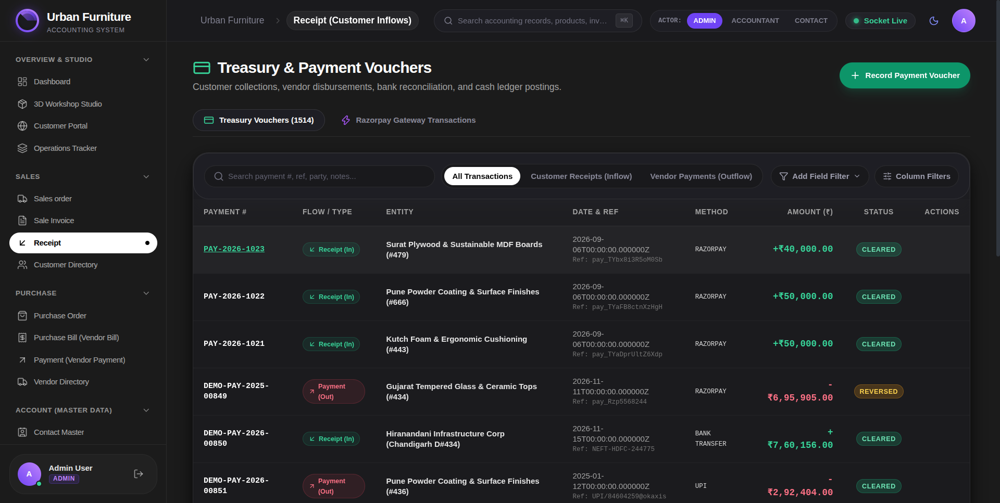

*Key Highlights:*
- **Auto-Populated Due Balances**: Automatically pulls partner name, remaining invoice dues, and outbound/inbound direction.
- **Instant Status Flip**: Turns invoice badges to green `PAID` with zero page refresh.

---

### 7. Operations Tracker & Audit Log
> **Route:** `/dashboard#analytics` / `/journal` | **Persona:** Admin & Accountant  
> Immutable operational audit trail displaying ledger postings, status flips, and time-stamped activity events.

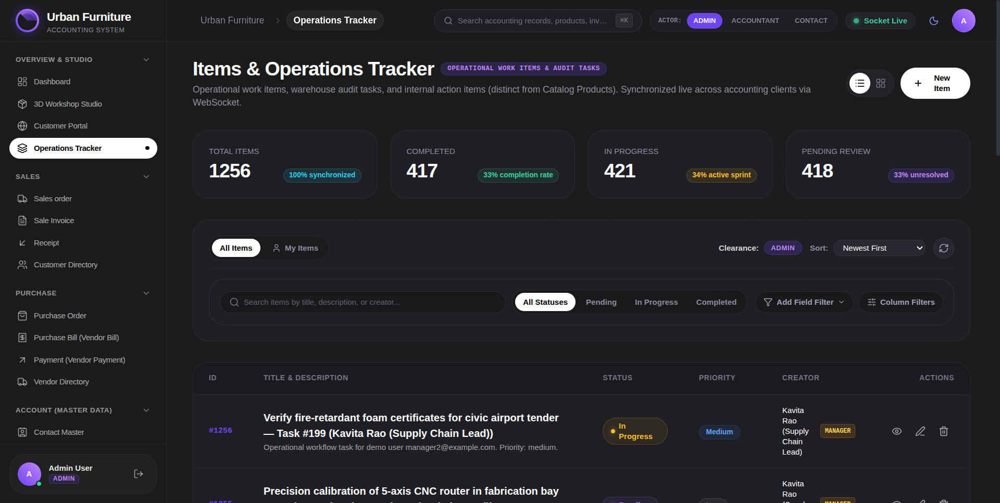

*Key Highlights:*
- **Mathematical Audit Trail**: Every entry verifies that Debits match Credits down to the paisa.
- **Comprehensive Activity Feed**: Records user actions, system automations, and payment reconciliations.

---

### 8. 3D Workshop & Joinery Studio
> **Route:** `/workshop` | **Persona:** Admin & Sales Engineers  
> Procedural 3D furniture visualizer with wood species and upholstery swatches, parametric dimension sliders, and live ERP PO dispatch.

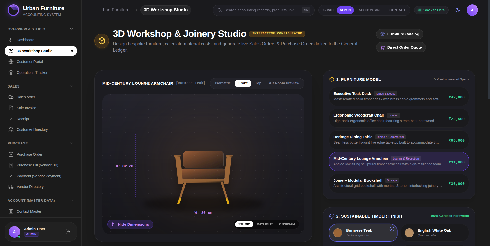

*Key Highlights:*
- **Multi-Perspective Viewports**: Isometric, Front Elevation, Top View, and Augmented Reality Room Preview.
- **Dynamic Physics & Costing**: Computes board-feet volume, species density rate, hardware costs, and projected profit margin in real time.
- **Direct ERP Dispatch**: Converts 3D specs directly into a backend Purchase Order for procurement dispatch.

---

### 9. Client Self-Service Portal
> **Route:** `/portal` | **Persona:** Contact (Customer: Joey Wills)  
> Isolated customer portal displaying outstanding invoices, account balance, and 1-click Razorpay payment execution.

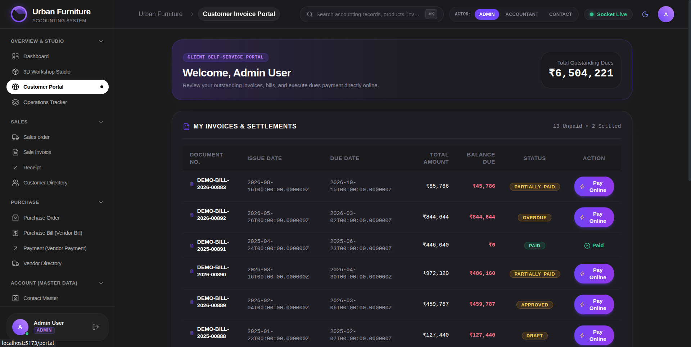

*Key Highlights:*
- **Contact-Scoped RBAC**: Completely hides internal accounting menus, journals, and administrative settings.
- **1-Click "Pay Now" Flow**: Launches embedded Razorpay modal for instant digital settlement.

---

### 10. Customer Master Directory
> **Route:** `/customers` | **Persona:** Admin & Accountant  
> Unified directory for corporate, retail, and municipal clients with toggleable List and Kanban views.

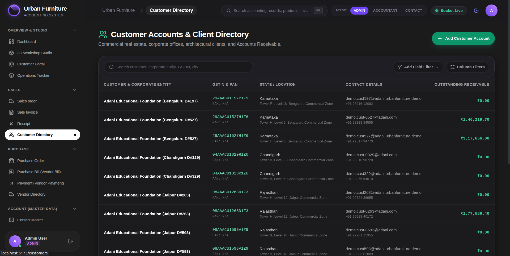

*Key Highlights:*
- **Dual View Engine**: Switch seamlessly between dense tabular rows and rich Kanban contact cards.
- **Full Partner Details**: Complete billing address, GSTIN, state code, credit terms, and transaction history.

---

### 11. Vendor Master Directory
> **Route:** `/vendors` | **Persona:** Admin & Accountant  
> Timber sawmill and hardware supplier directory tracking procurement volumes, outstanding balances, and payment terms.

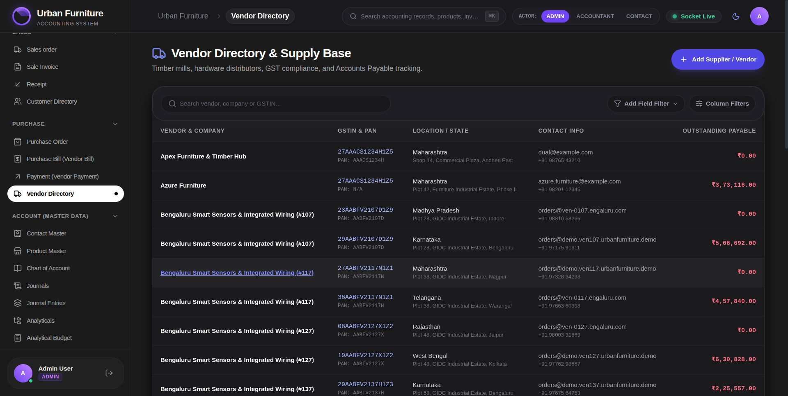

*Key Highlights:*
- **Procurement Balances**: Real-time display of total billed amounts, pending settlements, and active purchase orders.
- **Contact Profile Form**: Direct access to supplier bank credentials and GST jurisdiction.

---

## ⚡ Core Functional Modules

| # | Module | Route | Description & Business Logic |
|---|---|---|---|
| **01** | **Executive Dashboard** | `/` | Real-time KPI summaries, operational cards, activity heatmaps, dual-wave analytics, and live WebSocket connection indicator. |
| **02** | **Contact Master** | `/contacts`, `/customers`, `/vendors` | Unified partner directory (Customer, Vendor, Both) with List and Kanban cards, full address fields, and avatar badges. |
| **03** | **Product Master** | `/products` | Goods, Services, and Combo catalog with sales price, cost price, categories, HSN codes, and inventory stock adjustments. |
| **04** | **Chart of Accounts** | `/accounts` | Standard Indian Accounting COA (Assets `1xxx`, Liabilities `2xxx`, Equity `3xxx`, Income `4xxx`, Expenses `5xxx`) with individual ledger views. |
| **05** | **Journals Master** | `/journals` | Pre-configured Sales, Purchase, Bank, and Cash journals with default debit and credit offset accounts. |
| **06** | **General Ledger** | `/journal` | Immutable double-entry records enforcing strict debit/credit equality, partner references, and reversal capabilities. |
| **07** | **Sales Orders** | `/sales-orders` | Quote-to-order pipeline with line items, tax computations, and one-click "Create Invoice" automation. |
| **08** | **Customer Invoices** | `/invoices` | Auto-sequenced invoices (`INV/2026/XXXX`), vector PDF generation, automated GL posting on approval, and source SO linking. |
| **09** | **Purchase Orders** | `/purchase-orders` | Timber and hardware procurement, integration with 3D studio custom specs, and one-click "Create Bill" automation. |
| **10** | **Vendor Bills** | `/bills`, `/vendor-bills` | Accounts Payable bills defaulting to Purchase Expense A/c (`5111`), with origin PO badges and settlement modals. |
| **11** | **Treasury & Payments** | `/payments` | Inbound receipts and outbound disbursements with Bank/Cash offset postings, invoice reconciliation, and transaction ledger. |
| **12** | **Analytic Accounts** | `/analytic-accounts` | Project and cost-center accounting for tracking individual municipal contracts and manufacturing facilities. |
| **13** | **Budget Management** | `/budgets` | Multi-period analytical budgets, planned vs. actual variance tracking, achieved % formulas, and over-limit alert banners. |
| **14** | **Financial Reports** | `/reports` | Statutory reporting: Real-time Balance Sheet (Assets = Liabilities + Equity), Profit & Loss Statement, and Trial Balance. |
| **15** | **3D Workshop Studio** | `/workshop` | Procedural 3D CAD visualizer with timber/fabric swatches, parametric dimension sliders, live margin calculator, and direct PO dispatch. |
| **16** | **Razorpay Gateway** | `/payments#ledger` | Digital checkout modal, SHA256 webhook signature verification, automatic GL reconciliation, and treasury refund management. |
| **17** | **Customer Portal** | `/portal` | Dedicated, secure self-service portal for clients to inspect outstanding balances and settle invoices online. |

---

## 📂 Repository Structure

```text
Urban-Furniture-Accounting-System/
├── assets/                          # Official showcase screenshots and visual artifacts
│   ├── 3d-workshop-studio.png       # 3D parametric configurator & PO generator
│   ├── customer-directory.png       # Contact master (Customers)
│   ├── customer-portal.png          # Client self-service portal (/portal)
│   ├── dashboard.png                # Executive financial command center
│   ├── operations-tracker.png       # Operations ledger & audit log
│   ├── purchase-bill.png            # Vendor Bills (AP)
│   ├── purchase-order.png           # Raw material procurement
│   ├── receipt.png                  # Payment settlement receipt
│   ├── sale-invoice.png             # Customer Sales Invoice & vector PDF
│   ├── sales-order.png              # Commercial Sales Orders
│   └── vendor-directory.png         # Vendor master (Suppliers)
│
├── backend/                         # Laravel 13 REST API Application
│   ├── app/
│   │   ├── Http/
│   │   │   ├── Controllers/Api/     # 17 Resource Controllers (Invoices, Budgets, Razorpay, etc.)
│   │   │   ├── Middleware/          # RoleMiddleware (RBAC enforcement)
│   │   │   └── Requests/            # Form request validation rules
│   │   ├── Models/                  # 21 Eloquent Models with relationships and scopes
│   │   │   ├── Account.php          # Chart of Accounts
│   │   │   ├── AnalyticAccount.php  # Cost Centers & Project tagging
│   │   │   ├── Budget.php           # Analytical Budgets & Variance
│   │   │   ├── Invoice.php          # AR Invoices & AP Vendor Bills
│   │   │   ├── JournalEntry.php     # Double-entry ledger with debit/credit parity
│   │   │   ├── Payment.php          # Treasury settlements
│   │   │   ├── Product.php          # Goods, Services, Combo catalog
│   │   │   ├── PurchaseOrder.php    # Procurement orders
│   │   │   ├── SalesOrder.php       # Commercial orders
│   │   │   └── User.php             # Sanctum auth & RBAC personas
│   │   ├── Policies/                # InvoicePolicy, BudgetPolicy
│   │   └── Services/                # RealtimeService (Node.js webhook dispatcher)
│   ├── database/
│   │   ├── migrations/              # 19 normalized database migrations
│   │   └── seeders/                 # Realistic enterprise seeders (250+ records)
│   │       ├── ComprehensiveOperationsSeeder.php
│   │       ├── DatabaseSeeder.php
│   │       ├── DemoUserSeeder.php
│   │       └── ExcalidrawAccountingSeeder.php
│   └── routes/api.php               # Public & Sanctum-guarded endpoints
│
├── frontend/                        # React 18 + TypeScript SPA
│   ├── src/
│   │   ├── components/
│   │   │   ├── admin/               # User creation & RBAC management modals
│   │   │   ├── common/              # Obsidian skeletons, infinite scroll, status chips
│   │   │   ├── dashboard/           # HeroMetrics, DualWaveCurve, Heatmaps, Activity
│   │   │   ├── layout/              # Navbar, Sidebar, PageTransition, Socket badge
│   │   │   ├── payments/            # Razorpay Modal, Transaction Ledger tab
│   │   │   ├── pdf/                 # Invoice & Report vector PDF generators
│   │   │   └── ui/                  # Accessible HeroUI primitives (Button, Dialog, etc.)
│   │   ├── context/                 # AuthContext, SocketContext, ThemeContext, ToastContext
│   │   ├── lib/api.ts               # Centralized Axios client with Bearer interceptors
│   │   ├── pages/                   # 27 Application Screens
│   │   │   ├── DashboardPage.tsx    # Executive dashboard
│   │   │   ├── InvoicesPage.tsx     # Customer invoices & Vector PDF
│   │   │   ├── VendorBillsPage.tsx  # Vendor bills (AP)
│   │   │   ├── JournalPage.tsx      # General ledger & parity verification
│   │   │   ├── BudgetsPage.tsx      # Multi-period budget tracking & alerts
│   │   │   ├── WorkshopPage.tsx     # 3D Joinery Studio & parametric PO generator
│   │   │   └── CustomerPortalPage.tsx # Client self-service portal
│   │   └── types/index.ts           # Centralized TypeScript interfaces & enums
│   └── vite.config.ts               # Vite bundler configuration
│
├── realtime/                        # Node.js + Socket.io Broadcast Microservice
│   ├── server.js                    # WebSocket server & POST /api/broadcast webhook
│   └── test-client.js               # Automated socket integration test
│
├── docs/                            # Architectural artifacts & demo screenplay
│   ├── Accounting Hackathon - 24 Hours.excalidraw
│   ├── Accounting Hackathon - 24 Hours.excalidraw.svg
│   ├── Urban Furniture Accounting System.pdf
│   └── Urban_Furniture_Accounting_Demo_Script.pdf
│
├── docker-compose.yml               # Multi-container orchestration
├── package.json                     # Root orchestrator (npm run dev / setup)
├── setup.sh                         # Linux / macOS 1-click installation script
└── setup.ps1                        # Windows PowerShell 1-click installation script
```

---

## ⚡ Quick Start Guide

### Prerequisites
Make sure the following runtimes are installed on your workstation:
- **PHP** $\ge 8.2$ with `pdo_sqlite` or `pdo_mysql`, `mbstring`, `openssl`
- **Node.js** $\ge 18.0.0$ and **npm** $\ge 9.0.0$
- **Composer** $\ge 2.5.0$

---

### One-Command Installation
Clone the repository and run the automated setup script:

```bash
git clone https://github.com/Raj-Surase/Urban-Furniture-Accounting-System.git
cd Urban-Furniture-Accounting-System

# Run automated setup (copies .env, installs dependencies, runs migrations & seeds)
./setup.sh

# Or on Windows PowerShell:
# .\setup.ps1

# Or via npm root script:
# npm run setup
```

---

### Booting All Services Concurrently
Start the Laravel API, Socket.io Realtime Server, and React Vite Frontend with a single command:

```bash
npm run dev
```

Once booted, the three microservices will be live:
| Service | Local URL | Description |
| :--- | :--- | :--- |
| **Frontend Web App** | [`http://localhost:5173`](http://localhost:5173) | React SPA with Live Realtime Socket & Dual-Theme UI |
| **Backend REST API** | [`http://localhost:8000/api`](http://localhost:8000/api) | Laravel 13 REST API with Sanctum & RBAC Guards |
| **Realtime Microservice** | [`http://localhost:3001`](http://localhost:3001) | Socket.io server & `/api/broadcast` webhook ingress |

---

### 🔑 Pre-Seeded Demo Evaluation Personas

The database is pre-seeded with **250+ realistic enterprise operations records** (customers, vendors, products, sales orders, purchase orders, posted invoices, and double-entry journals).

The login page features **Instant 1-Click Demo Login Buttons** for frictionless evaluation:

| Persona | Demo Email | Password | Role Description & Access Rights |
| :--- | :--- | :--- | :--- |
| 👑 **System Admin** | `admin@example.com` | `password` | Full administrative control: Chart of Accounts, Journal entries, User governance, Budgets, and telemetry. |
| 💼 **Invoicing User (Accountant)** | `manager@example.com` | `password` | Operations & Accounting: Invoices, Bills, Payments, General Ledger, Financial Reports, and 3D Studio. |
| 👤 **Contact (Customer)** | `user@example.com` | `password` | Client Self-Service Portal (`/portal`): Displays Joey Wills' outstanding invoices with instant Razorpay checkout. |

> **Password Security Notice**: When creating new accounts via `/register`, our strict validation engine enforces: 6–12 character Login ID, minimum 8 characters, uppercase letter, lowercase letter, digit, and special character with confirmation parity.

---

## 🐳 Docker Deployment

To run the entire system in isolated Docker containers:

```bash
docker compose up --build
```

This starts:
- `hackathon_backend` (PHP 8.3-fpm / Laravel Artisan)
- `hackathon_realtime` (Node.js 20 / Socket.io)
- `hackathon_frontend` (Nginx serving built Vite React bundle)

---

## 🧪 Verification & Testing

### 1. Backend API Health Check
```bash
curl -X GET http://localhost:8000/api/health
```
```json
{
  "status": "ok",
  "app": "Urban Furniture Accounting Platform",
  "framework": "Laravel 13.x",
  "database": "sqlite",
  "timestamp": "2026-09-06T09:56:00Z"
}
```

### 2. Socket.io Health & Echo Test
```bash
curl -X GET http://localhost:3001/health
```
```json
{
  "status": "ok",
  "clientsCount": 1,
  "service": "Urban Furniture Realtime Broadcast Microservice"
}
```

### 3. Automated WebSocket End-to-End Test
```bash
cd realtime && node test-client.js
```

---

## 🏆 Hackathon Compliance Checklist

- [x] **Core Master Data Modules**: Contact Master (Customer/Vendor/Both), Product Master (Goods/Service/Combo), Chart of Accounts (`1xxx`–`5xxx`), and Journals (Sales, Purchase, Bank, Cash).
- [x] **Complete Transaction Lifecycles**: Purchase Order $\rightarrow$ Vendor Bill $\rightarrow$ Settlement; Sales Order $\rightarrow$ Customer Invoice $\rightarrow$ Receipt.
- [x] **Strict Double-Entry Bookkeeping**: Automated journal entry posting with balanced debit/credit parity checks down to the paisa.
- [x] **Analytic Accounting & Budgets**: Cost center tagging, multi-period budgets, planned vs. actual variance, achieved % formulas, and over-limit warnings.
- [x] **Statutory Financial Reports**: Real-time Balance Sheet (Assets = Liabilities + Capital), Profit & Loss Statement (Income - Expenses = Net Profit), and Budget Analysis.
- [x] **Parametric 3D Joinery Studio**: Procedural 3D visualizer with wood/fabric swatches, volumetric pricing, and direct PO dispatch.
- [x] **Razorpay Payment Gateway**: Branded checkout modal, mock sandbox mode, webhook callbacks, and automated GL bank reconciliation.
- [x] **Client Self-Service Portal**: Contact-scoped RBAC isolating customers to their own invoices with 1-click digital settlement.
- [x] **Live Realtime Synchronization**: Node.js + Socket.io microservice eliminating stale state without client-side polling.
- [x] **Dual-Theme Engine & UX Polish**: Obsidian Dark and Clean Light modes, universal multi-column filtering, infinite scroll, and obsidian shimmer skeletons.

---

## 👥 Authors & Team

Engineered with passion for the **Odoo Hackathon 2026** by the **Urban Furniture Accounting Development Team**.

- **GitHub Repository**: [Raj-Surase/Urban-Furniture-Accounting-System](https://github.com/Raj-Surase/Urban-Furniture-Accounting-System)
- **License**: MIT License
